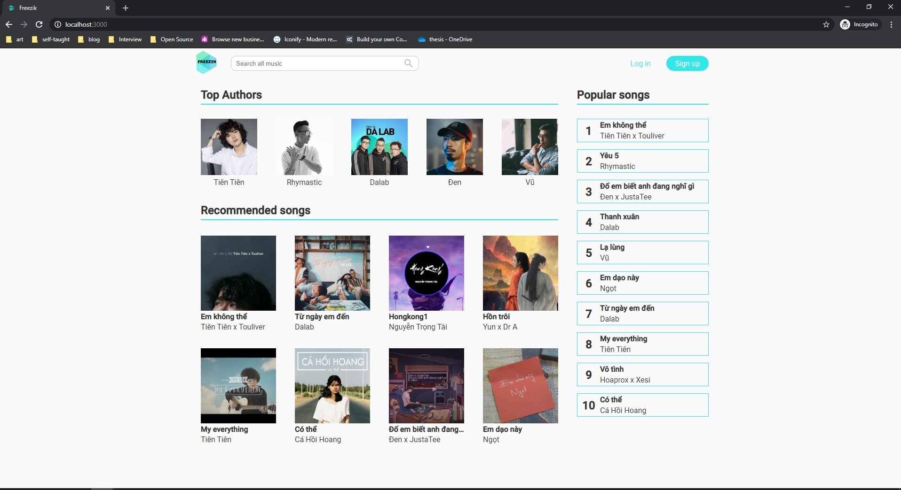

# FREEZIK



## Tech used

* ReactJS
* NodeJS

# Installation
Clone the repo:
```bash
$ git clone https://github.com/giangth2310/freezik.git
```
To run server, go to backend folder:
```bash
$ cd /freezik/backend
```
Install dependencies, start the server:
```bash
$ npm install
$ npm start
```
Server run on port 5000

To run client, go to fronted folder:
```bash
$ cd /freezik/front
```
Install dependencies and start client:
```bash
$ npm install
$ npm start
```
Client run on port 3000

# Tests
To run the test suite, first install the dependencies, then run npm test:
```bash
$ npm install
$ npm test
```

# Contribute
* Dinh Van Giang
* Truong Hoang Giang

# Contact
* dinhvangiang1198@gmail.com
* giangth2310@gmail.com

# License
